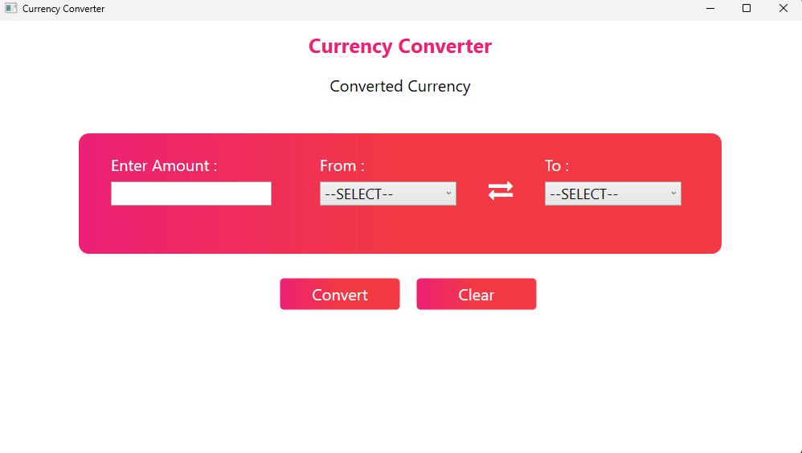

# Currency Converter.

The Currency Converter is a WPF application designed to convert one currency into another to check its corresponding value. The program is generally a part of a web site, or it forms a mobile app. It is based on the current market or bank exchange rates.

To convert one currency into another, all you need to do is enter an amount of money (e.g., '1000') and choose the currency and select the monetary value (e.g. "United States Dollar"). You can try with the multiple monetary selections. The application then calculates the entered amount with the exchange value and displays the corresponding amount of money.

# Technical Requirements for building the Currency Converter.

To build this application, I will be using the C# language to write the code for the core logic.

# Note.

fa:ImageAwesome tag is used to show the icon. To use this control first, you need to add "fontawesome.wpf" to the Library.

- Open solution explorer.
- Right-click on the project name. Select "Manage Nuget Packages." Select the Browse tab and search for "fontawesome.wpf" and select it and click on the install button.
